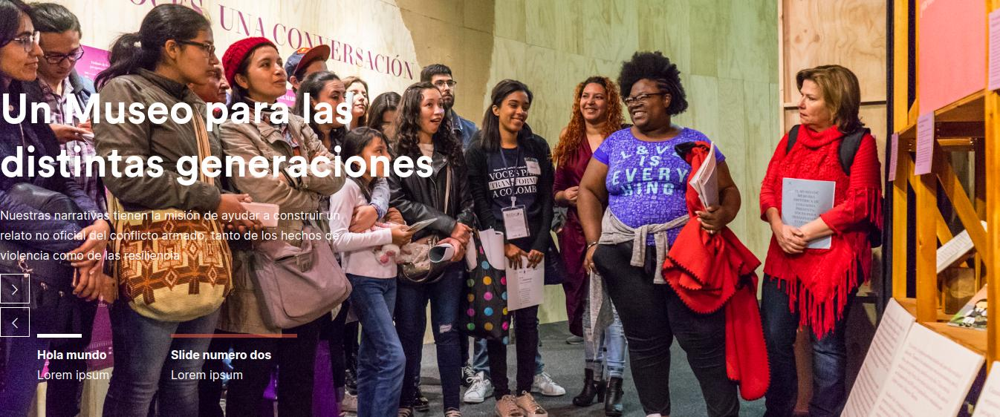
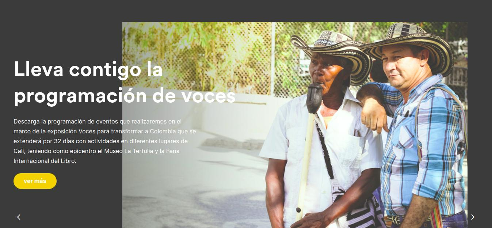
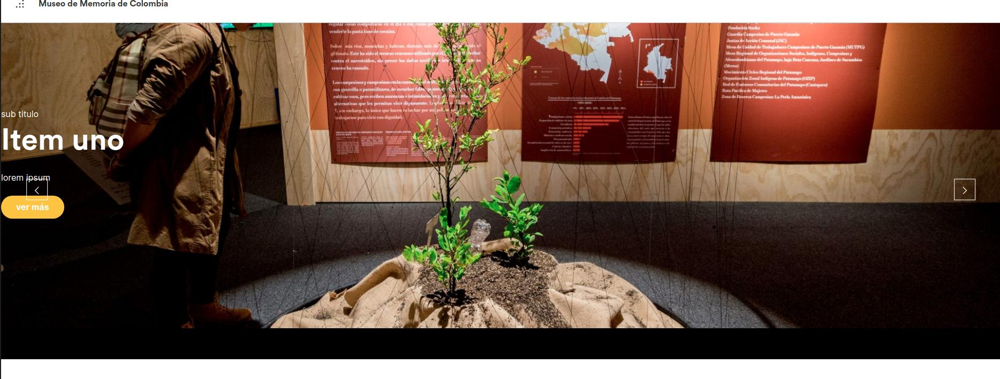
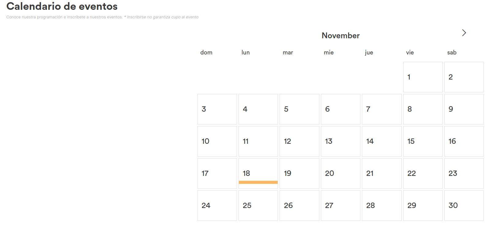
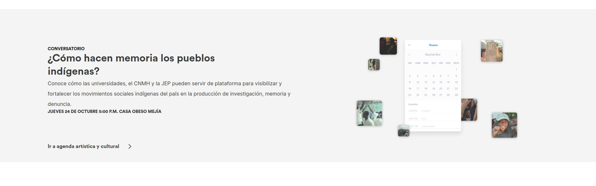
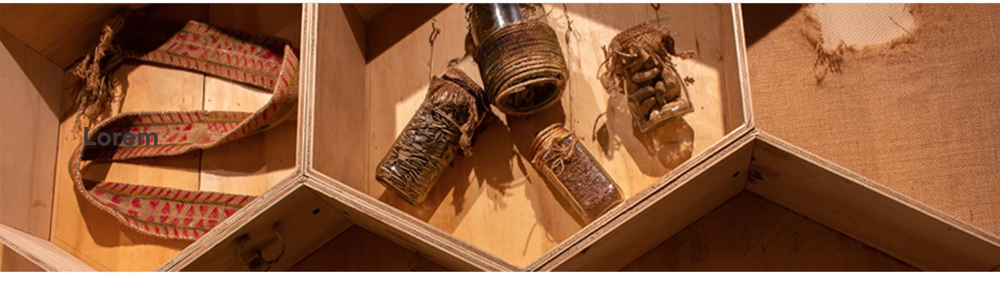
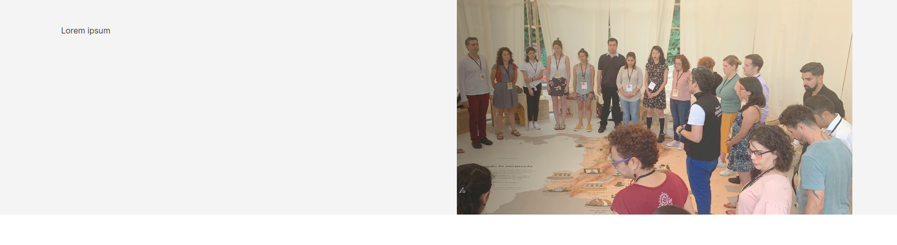
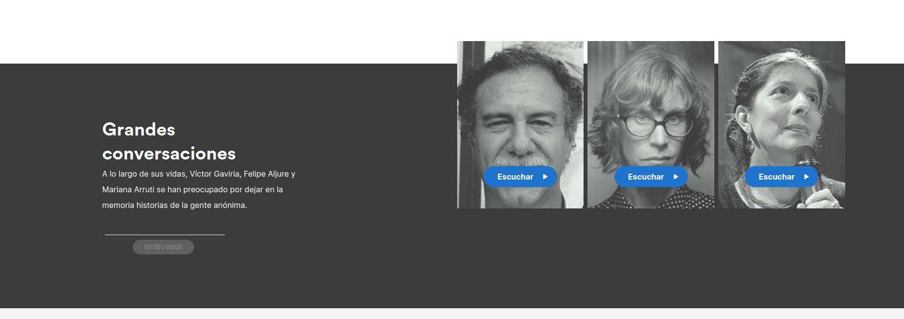

# [Museo de Memoria Histórica](http://museodememoria.gov.co)

> **AVISO:** Esta plantilla esta en desarrollo y no representa un producto final del equipo virtual del MNM. El MNM y el CNMH no se responsabilizan por el uso que se le de ni de lo que resulte de este.

## Estructura de la carpeta raíz

    ├── assets/                  # Partes del tema separados por archivos
        ├── css/                 # Carpeta con los archivos SCSS para el estilo
        ├── bloques/             # Archivos PHP con los bloques usados en la plataforma
        └── template-parts/      # Carpeta con los archivos PHP para cada parte de la estructura
    ├── fonts/                   # Fuentes con los iconos de la página
    ├── img/                     # Imágenes del tema
    ├── includes/                # Funciones del tema, organizadas por archivos, todas se importan al archivo functions.php
    ├── js/                      # Javascript de la página
    ├── languages/
    ├── functions.php            # Funciones del tema, archivo raíz
    └── page.php                 # Plantilla para todos los módulos. Aqui se cargan los bloques.

## Estructura de la carpeta /assets/bloques

    └── bloques/
        ├── bloque-banner-botones.php                   
        ├── bloque-banner-carrousel-margenes.php        
        ├── bloque-banner-carrousel.php                 
        ├── bloque-banner-tarjetas-audio.php            
        ├── bloque-banner-texto.php                     
        ├── bloque-bloque-agenda.php                    
        ├── bloque-bloque-banner-cita-imagen.php        
        ├── bloque-bloque-banner-corto-texto.php        
        ├── bloque-bloque-equipo.php                    
        ├── bloque-bloque-header-columna.php            
        ├── bloque-bloque-personajes.php                
        ├── bloque-carrousel-botones.php                
        ├── bloque-carrousel-cuadros.php                
        ├── bloque-carrousel-verticales.php             
        ├── bloque-cifra.php                            
        ├── bloque-galeria-carrousel.php                
        ├── bloque-imagen-botones.php                   
        ├── bloque-linea-tiempo.php                     
        ├── bloque-lista-tarjetas.php                   
        ├── bloque-listado-noticias.php                 
        ├── bloque-testimonios-carrousel.php            
        ├── bloque-tres-botones-segunda.php             
        └── bloque-tres-botones.php                     

### bloque-banner-botones



El bloque banner botones es parecido al banner carrousel pero se usan botones con textos descriptivos para cambiar entre los slides.

### bloque-banner-carrousel-margenes



El bloque banner carrousel margenes es una variación del banner carrousel pero las imágenes de fondo de cada slide tienen márgenes que dejan ver el fondo gris del bloque.

### bloque-banner-carrousel



Es un banner con un carrousel que ocupa todo el espacio del header a diferencia del bloque carrousel margenes.

### bloque-banner-tarjetas-audio


Banner al cual se le pueden añadir tarjetas para reproducir clips de audio. Tambien tiene soporte para agregar un texto abajo a la izquierda del bloque.

### bloque-banner-texto


Banner muy parecido a los anteriores pero solo tiene habilitado una entrada y un botón de saber más.

### bloque-bloque-agenda



Bloque que despliega un calendario y muestra los eventos que están por venir.

### bloque-banner-cita-imagen



Bloque que se divide en dos, una imagen a la izquierda y texto a la derecha, a manera de banner con texto.

### bloque-banner-corto-texto



Banner para desplegar una imagen tipo banner pero menos alta y con la posibilidad de añadir un texto oscuro (para una imagen clara).

### bloque-equipo


Un carrousel con tarjetas que permiten desplegar un texto abajo, en la página se usa para mostrar los perfiles del equipo.

### bloque-header-columna



//TODO actualizar los estilos del titulo y del texto de este bloque

### bloque-personajes



Bloque que despliega tres tarjetas, cada una con su audio. Incluye reproductor con tiempo para la reproducción.

### carrousel-botones


## Estructura de la carpeta /assets/template-parts

    └── template-parts/
        ├── head.php                    # Contenido del HEAD
        ├── sideMenu.php                # Menu lateral
        └── top_header.php              # Menu superior transversal a toda la página

## Scripts para desarollo

La plantilla usa el compilador para SASS de NODE.js
Para usarlo en el terminal, se debe primero instalar las dependencias:

```bash
npm install
```

Al momento del desarrollo, hay dos opciones. La primera compilar el CSS una vez:

```bash
npm run css
```

O activar el watch para que se actualice auntomaticamente cada vez que detecta cambios en los archivos de la carpeta:

```bash
npm run watch
```
